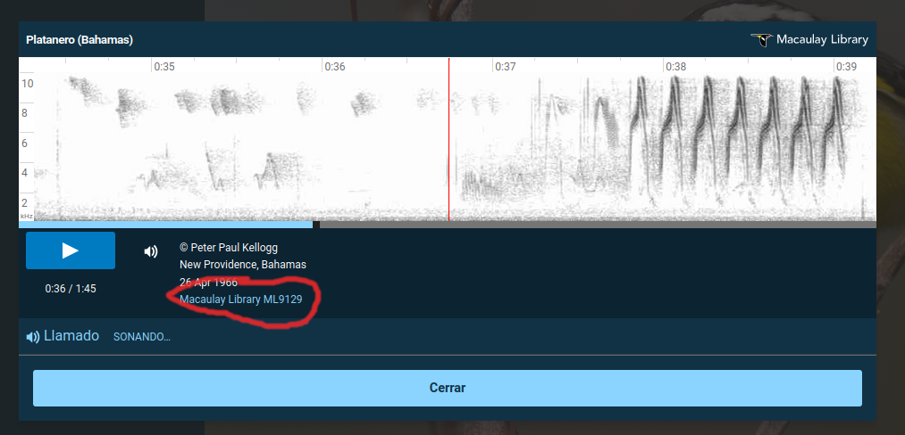
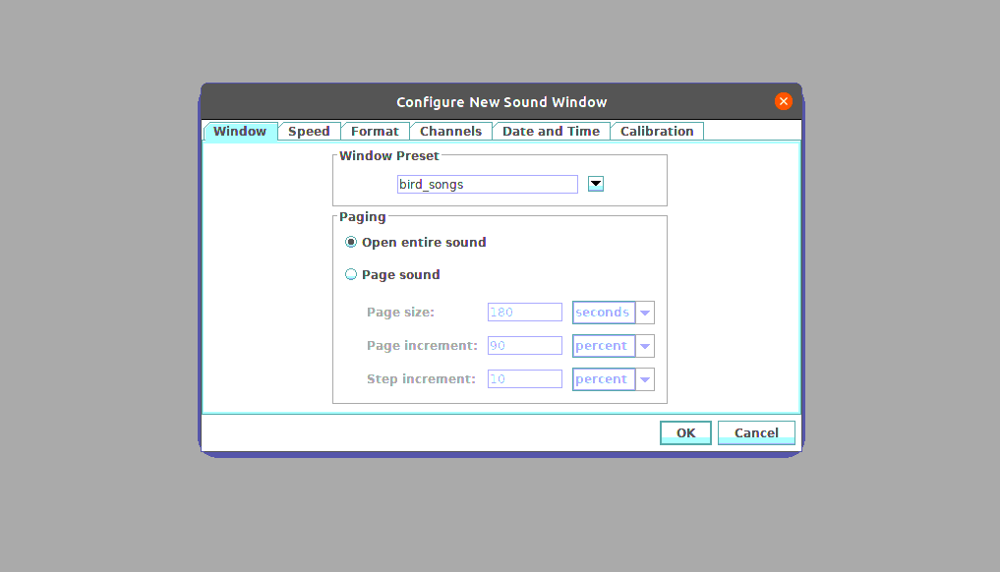
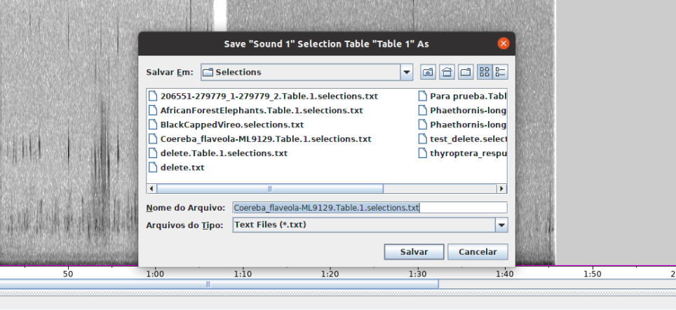
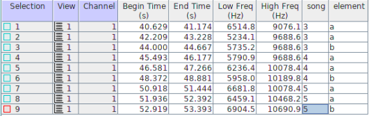
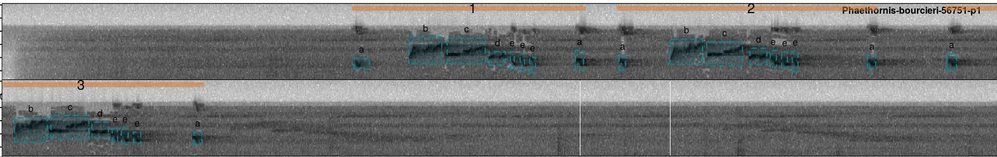
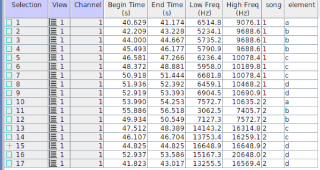

*Updated on `r Sys.time()`*

<!-- README.md is generated from README.Rmd. Please edit that file -->

```{r, include = FALSE}

library(rmarkdown)

knitr::opts_chunk$set(
  collapse = TRUE,
  out.width = "100%"
)

```


## Table of contents
* [Data links](#data-links)
* [Analysis workflow](#analysis-workflow)
    * [Getting a file to annotate](#getting-a-file-to-annotate)
    * [Annotating bird songs](#annotating-bird-songs)
    * [Examples](#examples)
    * [Additional annotation tips](#additional-annotation-tips)
* [Status](#status)
* [To-do list](#to-do-list)
* [Contact](#contact)


## Purpose

- *This protocol explains the steps required to conduct an objective assessment of the vocal behavior of several bird species using recordings from the Macaulay Library*

&nbsp;

--- 

## Data links

- [Spreadsheet with the recording info and metadata](https://docs.google.com/spreadsheets/d/16ukhyf37hm13f1FXB2JQ-tCfHoxXy2qj_TX2xWvTVu8/edit?usp=sharing) 
- [Recordings by family](https://6f33fa7f78ea46e2aaca-my.sharepoint.com:443/:f:/g/personal/marcelo_araya_ucr_ac_cr/EoaMWjKcnuZEuStxMx6Ck2YBkNaSElvK5DdRA9MeUOsTYQ?e=HLMSEf)
- [Raven window preset file](https://github.com/maRce10/bird_song_evolution/raw/master/bird_songs)
- [Online folder for uploading selection files](https://drive.google.com/drive/folders/1SqeJQFmWXP3u0zdeEMr1r-1wDY6Az73c?usp=sharing)

---

## Analysis workflow

### Getting a file to annotate

1. Find the files you have been assigned to in the [recording spreadsheet](https://docs.google.com/spreadsheets/d/16ukhyf37hm13f1FXB2JQ-tCfHoxXy2qj_TX2xWvTVu8/edit?usp=sharing). Look at the "assigned_to" column:

```{r, out.width = "100%", echo = FALSE}

knitr::include_graphics("./scripts/metadata_doc.png")

```
&nbsp;

2. Open the species eBird page by clicking on the link in the "species_ebird_url"  column:

```{r, out.width = "100%", echo = FALSE}

knitr::include_graphics("./scripts/species_link.png")

```
&nbsp;

3. Look up the species in [https://ebird.org/explore](https://ebird.org/explore) to get an example of the species typical song. In this example the species is *Phaethornis longirostris*:


4. Click on  the "listen" ("escuchar") button:

```{r, out.width = "100%", echo = FALSE}

knitr::include_graphics("./scripts/banana.png")

```
&nbsp;

5. Look for the example that matches the ID number in our data base:

```{r, out.width = "100%", echo = FALSE}



```
&nbsp;

6. Look at the vocalization description for that recording on eBird and write it down in “vocalization_type” column in “recordings_metadata.xlsx” file:

```{r, out.width = "100%", echo = FALSE}

knitr::include_graphics("./scripts/spectro_marked2.png")

```
&nbsp;


**The spectrogram that is shown contains what experts have identified as a good example of the species' vocalization, so it will be used to define which signals in our sound files will be annotated.**

&nbsp;

---

## Annotating bird songs

1. Open the sound file in Raven: Ctrl + O (or go to file → open sound files). The sound file names follows the syntax "species_name_ID_number.wav":

```{r, out.width = "100%", echo = FALSE}

knitr::include_graphics("./scripts/open_file.png")

```
&nbsp;

2. When you open the file a "Configure New Sound Window" window will pop-up. In the "Window Preset" window, choose the "bird_songs" option and then click "OK" (if this window does not open when loading a file you must go to View → Window Preset and select "bird_song_evolution"). This present can be download [from here](https://github.com/maRce10/bird_song_evolution/raw/master/bird_songs) and should be copied into "./RavenPro1.6/Presets/Sound Window":

```{r, out.width = "100%", echo = FALSE}



```
&nbsp;

The selection table should include the columns "Begin File", "Begin Path", "song" and "element":

```{r, out.width = "100%", echo = FALSE}

knitr::include_graphics("./scripts/raven_banana.png")

```
&nbsp;

3. Examine the recording to determine the position of the signals that are shown in the spectrogram on the eBird web page.

4. Determine the sequence of elements of which the song is composed. *A song can be defined by the repetition of a sequence of elements* (even if the sequence is a single element) *and/or by long silences* (much greater than the silences between elements within a song). Sequence repetitions can vary in the composition and number of repeats of individual elements. Again, the example in the eBird web page should be used as a guide to determine vocalization structure. **[This step is further explain below](#examples)**.

5. Once you commit the selection (pressing “Enter”), **each element must be tagged with the song to which it belongs** (Raven will ask for the tag each time a new selection is entered). The label must be a number for the song and a letter for the element (eg "1a" for element "a" in song "1"). 

6. Save the selections with the name suggested by Raven (which includes the sound file name). In that way we can easily track the recording they belong to:
```{r, out.width = "100%", echo = FALSE}



```
&nbsp;

7. Update the [recording spreadsheet google doc](https://docs.google.com/spreadsheets/d/16ukhyf37hm13f1FXB2JQ-tCfHoxXy2qj_TX2xWvTVu8/edit?usp=sharing): add the current date to the "analyzed_to" column.

8. Once you are done for the day load the selection tables [to this online folder](https://drive.google.com/drive/folders/1SqeJQFmWXP3u0zdeEMr1r-1wDY6Az73c?usp=sharing).
&nbsp;

9. Start with a new species.

---

### Examples


This is an example of a song from the hummingbird *Anoupetia gounellei* (a 2-row spectrogram):

```{r, out.width = "100%", echo = FALSE}

knitr::include_graphics("./scripts/anopetia_examp.png")

```
&nbsp;          


The orange lines with a single number on top  refer to the song while the blue boxes refer to each of the elements. The letter on top of the boxes are the element categories (or element types). In the example above, the song is composed of 2 elements types, **a** and **b** in which **a** is repeated twice at the beginning of the song and **b** is uttered just once at the end. So there are 3 songs selected (labeled as 3, 4 and 5). In this case the song can be told apart as fixed sequence of elements, but notice that the gap between elements and between song is similar.  

The selection table for this recording would look like this:

```{r, out.width = "70%", echo = FALSE}



```

*(Note that song starts at 3 to match the labels in the image, but song labels should start at 1)*

A similar structure is found in songs of *Phaethornis bourcieri* (clearly repeated element sequence but gaps similar between songs and elements):

```{r, out.width = "100%", echo = FALSE}



```
&nbsp;         


This other example from *Glaucis hirsutus* shows songs that are clearly differentiated by long silence gaps:
```{r, out.width = "100%", echo = FALSE}

knitr::include_graphics("./scripts/glaucis.png")

```
&nbsp;         

Also note that the sequence of elements for different songs is very similar but not exactly the same. In the absence of long gaps this could be used for telling songs apart.

The selection table for the songs in the *Glaucis* spectrogram above:
```{r, out.width = "70%", echo = FALSE}



```
&nbsp;         


This is a nother example (*Phaethornis aethopygus*) with a similar pattern (song separated by both long gaps and the element sequence pattern):
```{r, out.width = "100%", echo = FALSE}

knitr::include_graphics("./scripts/p_aethopygus.png")

```
&nbsp;         

### Additional annotation tips

1. Ensure that the selected sounds belong to a single individual (or pair if a duet, for instance in wrens). Sometimes more than one individual can be found in a single recording. This can be identified by overlapping in time and frequency but with similar 

1. Select the beginning and end of each of the elements for **up to 5 songs** (if available). Songs do not have to be consecutive. If there are more songs available in the recordings and they vary considerably you can try to measure more songs.

1. Make selections on the spectrogram by adjusting both time and frequency. If the songs have a lot of harmonics the high frequency try to include both the fundamental frequency (harmonic with the lowest frequency) and dominant frequency (harmonic with the highest energy), which sometimes can be the same harmonic.

1. Set the beginning and end (the margins of the selection box) right at the beginning and end of the element, trying not to include the reverberations at the end of the element.

1. Avoid annotating songs in which the elements overlap other sounds.

1. If the recording was made on 2 channels, make the selections only on the first channel (the one on top).

1. Different elements should be labeled with different letters (so elements that look the same should be labeled with the same letter)

1. Save the selection in the default folder suggested by Raven. When you try to close the audio file Raven will ask if they want to save the selection, just click OK and keep the suggested file name unchanged.

1. If there is something inconsistent or poorly explained in this protocol please let us know!


```{r, eval = FALSE, echo = FALSE}

    1. If there is something wrong with the recording (e.g. doesn’t have vocalizations too noisy, or the file was not found, etc) add the information to the “comments” column in "recordings_metadata.xlsx".

    1. Some species seem to have multiple song types (both simple and complex songs). If this seems to be the case it’s most important that the complex songs are selected. 

Examples

1.Single song repertoire: 

This refers to songs composed by a single element that is repeated over and over again. In this case each sound represents an element and a song and should be labeled 1a, 2a, 3a, etc:


For “full song” selections in single song repertoire species we should include several elements (ideally 5) in the same selection box.


```


## To-do list

* Do the next analysis

## Status
Project is: _in progress_

## Contact
Created by [Marcelo Araya-Salas](http://marceloarayasalas.weebly.com)
