<b>Song annotation protocol</b> 
================
<a href="http://marceloarayasalas.weebly.com/">Marcelo
Araya-Salas, PhD</a> 

*Updated on 2023-03-27 21:05:53*

<!-- README.md is generated from README.Rmd. Please edit that file -->

## Table of contents

- [Data links](#data-links)
- [Analysis workflow](#analysis-workflow)
  - [Getting a file to annotate](#getting-a-file-to-annotate)
  - [Annotating bird songs](#annotating-bird-songs)
  - [Examples](#examples)
  - [Additional annotation tips](#additional-annotation-tips)
- [Status](#status)
- [To-do list](#to-do-list)
- [Contact](#contact)

## Purpose

- *This protocol explains the steps required to conduct an objective
  assessment of the vocal behavior of several bird species using
  recordings from the Macaulay Library*

 

------------------------------------------------------------------------

## Data links

- [Spreadsheet with the recording info and
  metadata](https://docs.google.com/spreadsheets/d/16ukhyf37hm13f1FXB2JQ-tCfHoxXy2qj_TX2xWvTVu8/edit?usp=sharing)

- [Recordings by
  family](https://6f33fa7f78ea46e2aaca-my.sharepoint.com:443/:f:/g/personal/marcelo_araya_ucr_ac_cr/EoaMWjKcnuZEuStxMx6Ck2YBkNaSElvK5DdRA9MeUOsTYQ?e=HLMSEf)

- [Raven window preset
  file](https://github.com/maRce10/bird_song_evolution/raw/master/bird_songs)

- [Online folder for uploading selection
  files](https://drive.google.com/drive/folders/1SqeJQFmWXP3u0zdeEMr1r-1wDY6Az73c?usp=sharing)

- [Current status log](https://rpubs.com/marcelo-araya-salas/1013041)

- ## [Annotated spectrograms](https://6f33fa7f78ea46e2aaca-my.sharepoint.com/personal/marcelo_araya_ucr_ac_cr/_layouts/15/onedrive.aspx?ga=1&id=%2Fpersonal%2Fmarcelo_araya_ucr_ac_cr%2FDocuments%2Fannotated_spectrograms)

## Analysis workflow

### Getting a file to annotate

1.  Find the files you have been assigned to in the [recording
    spreadsheet](https://docs.google.com/spreadsheets/d/16ukhyf37hm13f1FXB2JQ-tCfHoxXy2qj_TX2xWvTVu8/edit?usp=sharing).
    Look at the “assigned_to” column:

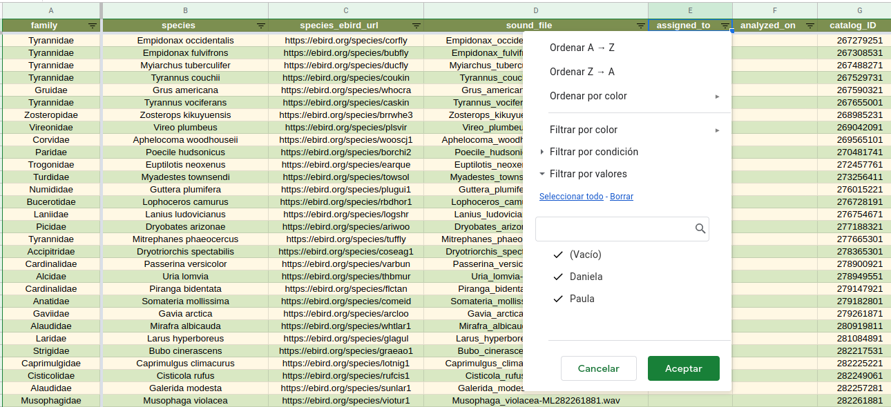  

2.  Open the species eBird page by clicking on the link in the
    “species_ebird_url” column:

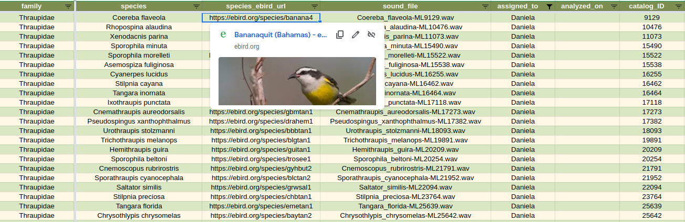  

3.  Look up the species in <https://ebird.org/explore> to get an example
    of the species typical song. In this example the species is
    *Phaethornis longirostris*:

4.  Click on the “listen” (“escuchar”) button:

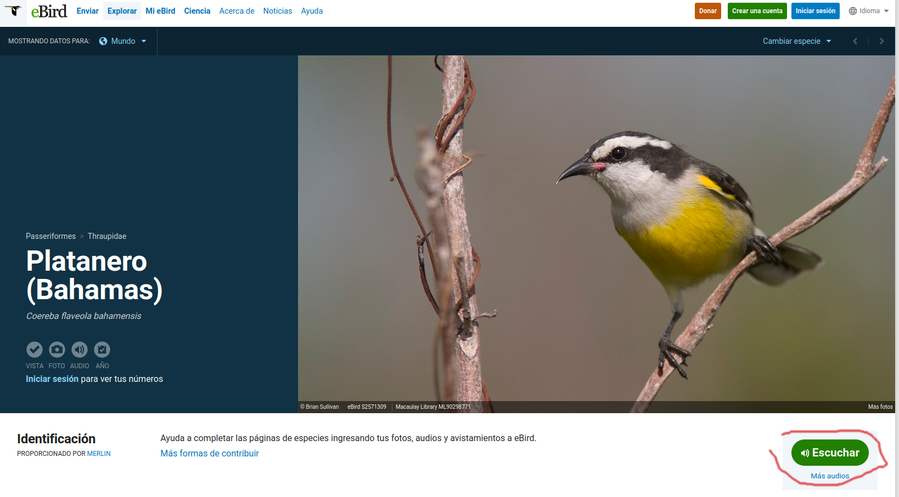  

5.  Look for the example that matches the ID number in our data base:

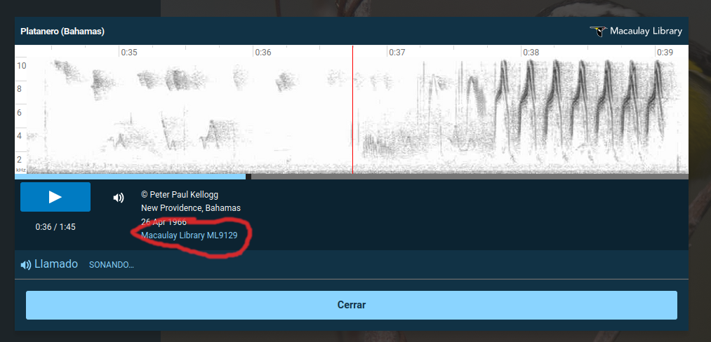  

6.  Look at the vocalization description for that recording on eBird and
    write it down in “vocalization_type” column in
    “recordings_metadata.xlsx” file:

  

**The spectrogram that is shown contains what experts have identified as
a good example of the species’ vocalization, so it will be used to
define which signals in our sound files will be annotated.**

 

------------------------------------------------------------------------

## Annotating bird songs

1.  Open the sound file in Raven: Ctrl + O (or go to file → open sound
    files). The sound file names follows the syntax
    “species_name_ID_number.wav”:

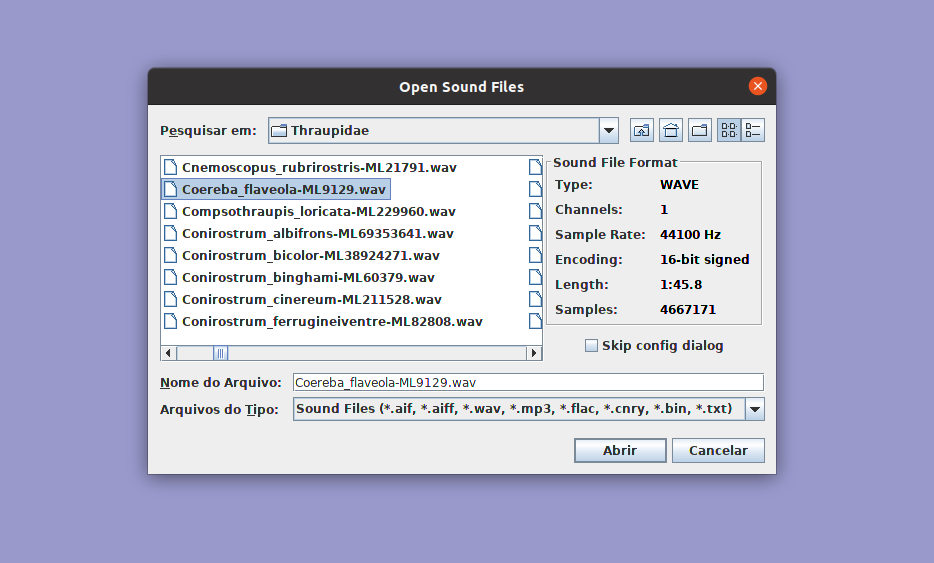  

2.  When you open the file a “Configure New Sound Window” window will
    pop-up. In the “Window Preset” window, choose the “bird_songs”
    option and then click “OK” (if this window does not open when
    loading a file you must go to View → Window Preset and select
    “bird_song_evolution”). This preset can be downloaded [from
    here](https://github.com/maRce10/bird_song_evolution/raw/master/bird_songs)
    and should be copied into “./RavenPro1.6/Presets/Sound Window”:

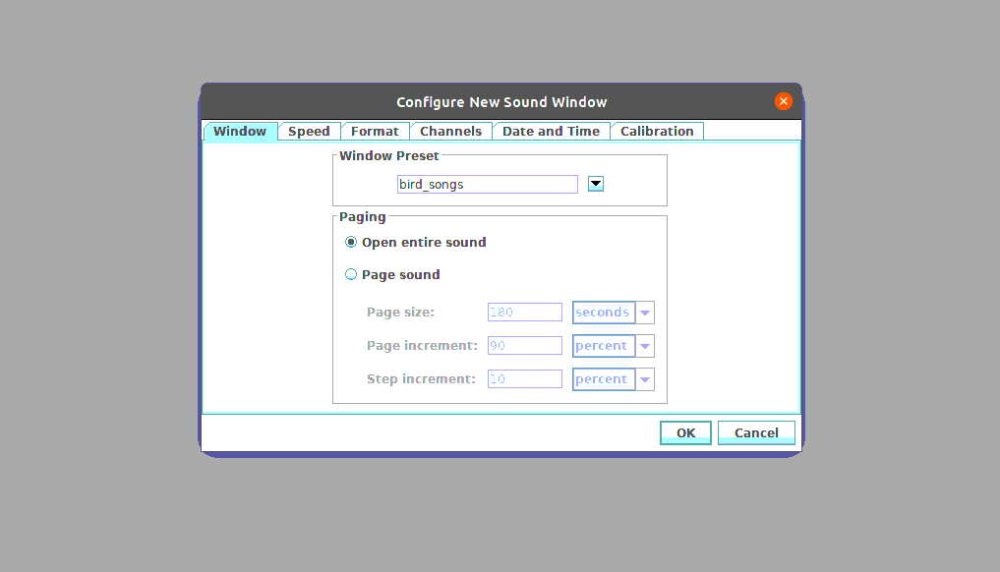  

The selection table should include the columns “Begin File”, “Begin
Path”, “song” and “element”:

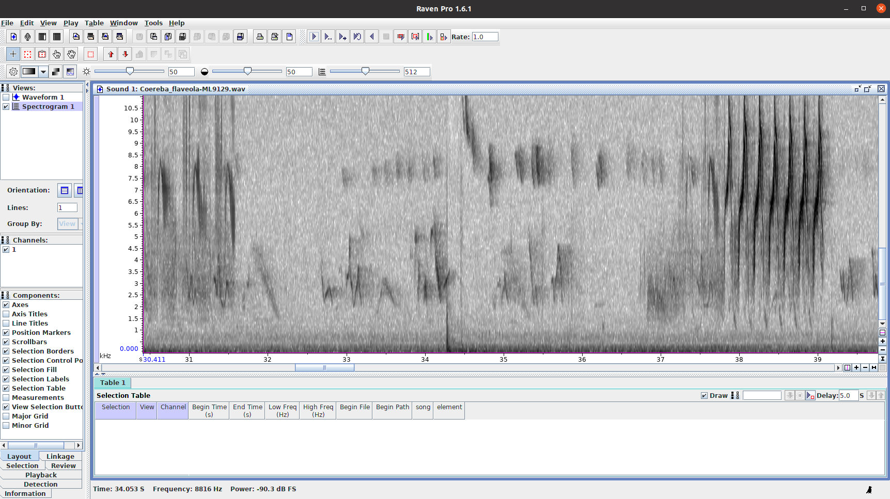  

3.  Examine the recording to determine the position of the signals that
    are shown in the spectrogram on the eBird web page.

4.  Determine the sequence of elements of which the song is composed. *A
    song can be defined by the repetition of a sequence of elements*
    (even if the sequence is a single element) *and/or by long silences*
    (much greater than the silences between elements within a song).
    Sequence repetitions can vary in the composition and number of
    repeats of individual elements. Again, the example in the eBird web
    page should be used as a guide to determine vocalization structure.
    **[This step is further explain below](#examples)**. If some
    elements have other unison sounds they should be included as part of
    the song.

5.  Once you commit the selection (pressing “Enter”), **each element
    must be tagged with the song to which it belongs** (Raven will ask
    for the tag each time a new selection is entered). The label must be
    a number for the song and a letter for the element (eg “1a” for
    element “a” in song “1”).

6.  Save the selections with the name suggested by Raven (which includes
    the sound file name). In that way we can easily track the recording
    they belong to: 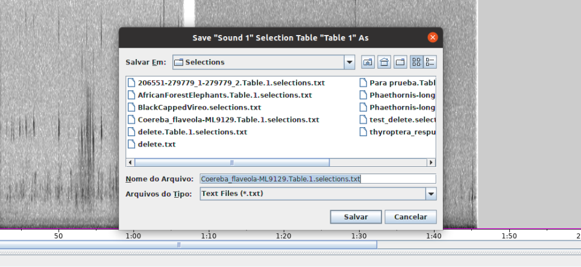  

7.  Update the [recording spreadsheet google
    doc](https://docs.google.com/spreadsheets/d/16ukhyf37hm13f1FXB2JQ-tCfHoxXy2qj_TX2xWvTVu8/edit?usp=sharing):
    add the current date to the “analyzed_to” column.

8.  Once you are done for the day load the selection tables [to this
    online
    folder](https://drive.google.com/drive/folders/1SqeJQFmWXP3u0zdeEMr1r-1wDY6Az73c?usp=sharing).
     

9.  Start with a new species.

------------------------------------------------------------------------

### Examples

This is an example of a song from the hummingbird *Anoupetia gounellei*
(a 2-row spectrogram):

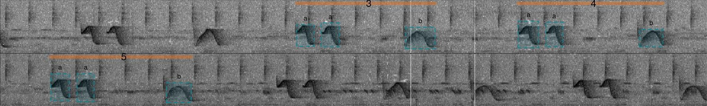  

The orange lines with a single number on top refer to the song while the
blue boxes refer to each of the elements. The letter on top of the boxes
are the element categories (or element types). In the example above, the
song is composed of 2 elements types, **a** and **b** in which **a** is
repeated twice at the beginning of the song and **b** is uttered just
once at the end. So there are 3 songs selected (labeled as 3, 4 and 5).
In this case the song can be told apart as fixed sequence of elements,
but notice that the gap between elements and between song is similar.

The selection table for this recording would look like this:

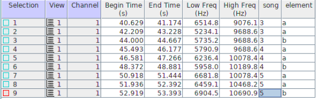

*(Note that song starts at 3 to match the labels in the image, but song
labels should start at 1)*

A similar structure is found in songs of *Phaethornis bourcieri*
(clearly repeated element sequence but gaps similar between songs and
elements):

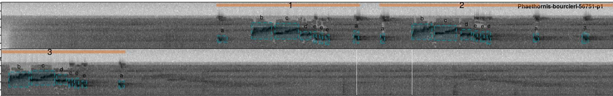  

This other example from *Glaucis hirsutus* shows songs that are clearly
differentiated by long silence gaps:
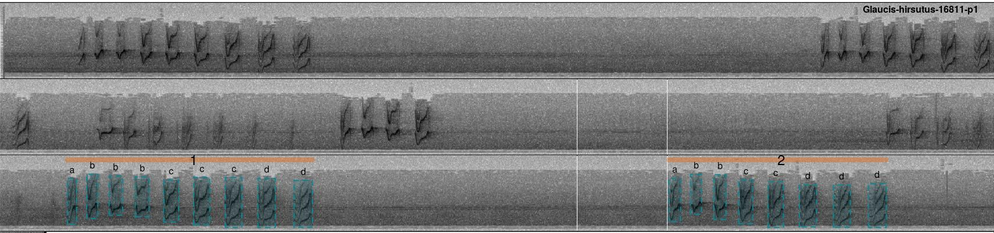  

Also note that the sequence of elements for different songs is very
similar but not exactly the same. In the absence of long gaps this could
be used for telling songs apart.

The selection table for the songs in the *Glaucis* spectrogram above:
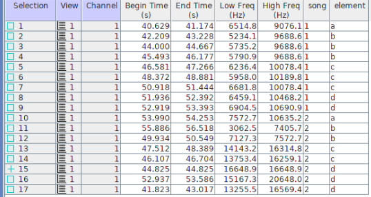  

This is a nother example (*Phaethornis aethopygus*) with a similar
pattern (song separated by both long gaps and the element sequence
pattern): 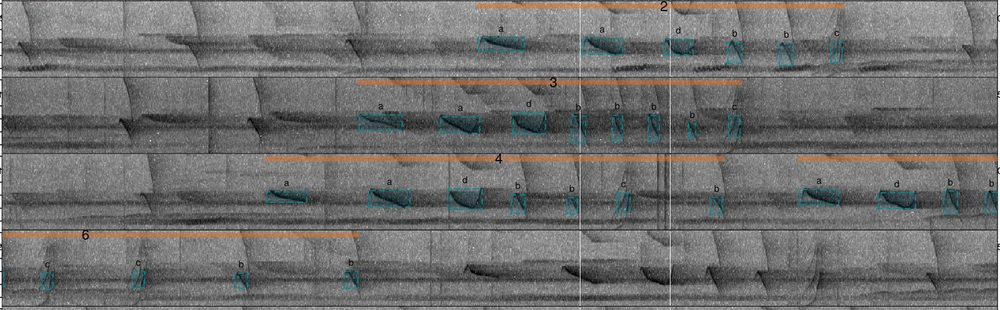  

### additional criteria for annotating

1.  Ensure that the selected **sounds belong to a single individual**
    (or pair if a duet, for instance in wrens). Sometimes more than one
    individual can be found in a single recording. This can be
    identified by signals overlapping in time and frequency but with
    similar structure and timing

2.  Select the beginning and end of each of the elements for **up to 3
    songs** (if available). Songs do not have to be consecutive. Avoid
    those songs that look incomplete (e.g. if most songs have 5-6
    elements and there is a couple with 2 elements avoid measuring the
    latter).

3.  **Make selections on the spectrogram** by adjusting both time and
    frequency. If the songs have a lot of harmonics include both the
    fundamental frequency (harmonic with the lowest frequency) and
    dominant frequency (harmonic with the highest energy), which
    sometimes can be the same harmonic. If individual harmonics are not
    easy to tell apart select the range of harmonics that clearly stand
    over the background noise.

4.  Set the beginning and end (the margins of the selection box) right
    at the beginning and end of the element, **excluding the
    reverberations** at the end of the element.

5.  **Avoid annotating songs in which the elements overlap other
    sounds**.

6.  Include acoustic **units repeated in sequence with little time gaps
    in between (for instance trills) as a single element** (i.e. a
    single annotation box).

7.  If the recording was made on 2 channels, make the **selections only
    on the first channel** (the one on top).

8.  If the recording we have doesn’t contain a song (and the species
    clearly has songs) look for other recordings in the Macaulay Library
    and write down the code in the “recording_needed” column.

9.  **Duets should not be annotated unless each note can be
    distinguished**. Make sure the vocalization type is labeled as duet
    and a note in comments.

10. **Save the selection in the default folder suggested by Raven**.
    When you try to close the audio file Raven will ask if they want to
    save the selection, just click OK and keep the suggested file name
    unchanged.

11. If the structure of the song is hard to define **look up for papers
    describing the song** for that species and include the paper
    citation into comments.

12. If there is something inconsistent or poorly explained in this
    protocol please let us know!

## To-do list

- Develop algorithms to:
  - Tell which sound should belong to the same element based on the
    average distance between elements within a song
  - Define decision rules to tell which elements belong to the same
    category based on the similarities found in song with good
    inter-observer agreement in element clasification (maybe using
    cross-correlation)
- Add examples of trill and gradually changing sounds that should be
  annotated as a single element

## Status

Project is: *in progress*

## Contact

Created by [Marcelo Araya-Salas](http://marceloarayasalas.weebly.com)
