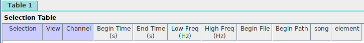

<b>Song annotation protocol</b>

================

<a href="http://marceloarayasalas.weebly.com/">Marcelo
Araya-Salas, PhD</a>

 

*Updated on 2022-05-30 10:35:45*

<!-- README.md is generated from README.Rmd. Please edit that file -->

## Table of contents

-   [Data links](#data-links)
-   [Analysis workflow](#analysis-workflow)
    -   [Finding the right file](#finding-the-right-file)
    -   [Annotating bird songs](#annotating-bird-songs)
-   [Status](#status)
-   [To-do list](#to-do-list)
-   [Contact](#contact)

## Purpose

-   *This protocol explains the steps required to conduct an objective
    assessment of the vocal behavior of several bird species using
    recordings from the Macaulay Library*

 

------------------------------------------------------------------------

## Data links

-   [Spreadsheet with the recording info and
    metadata](https://docs.google.com/spreadsheets/d/16ukhyf37hm13f1FXB2JQ-tCfHoxXy2qj_TX2xWvTVu8/edit?usp=sharing)
-   [Recordings by
    family](https://6f33fa7f78ea46e2aaca-my.sharepoint.com/:f:/g/personal/marcelo_araya_ucr_ac_cr/EoaMWjKcnuZEuStxMx6Ck2YB4pLLQZSS-sdEMyayZbTs8g?e=y9zuIA)

------------------------------------------------------------------------

## Analysis workflow

### Getting a file to annotate

Find the files you have been assigned to in the [recording
spreadsheet](https://docs.google.com/spreadsheets/d/16ukhyf37hm13f1FXB2JQ-tCfHoxXy2qj_TX2xWvTVu8/edit?usp=sharing).
Look at the “assigned_to” column:

  

Open the species ebird page by clicking on the link in the
“species_ebird_url” column:

  

1.  Look up the species in <https://ebird.org/explore> to get an example
    of the species typical song. In this example the species is
    *Phaethornis longirostris*:

2.  Click on the “listen” (“escuchar”) button:

  

1.  Look for the example that matches the ID number in our data base:

  

1.  Look at the vocalization description for that recording on ebird and
    write it down in “vocalization_type” column in
    “recordings_metadata.xlsx” file:

  

**The spectrogram that is shown contains what experts have identified as
a good example of the species’ vocalization, so it will be used to
define which signals in our sound files will be annotated.**

 

------------------------------------------------------------------------

## Annotating bird songs

1.  Open the sound file in Raven: Ctrl + O (or go to file → open sound
    files). The sound file names follows the syntax
    “species_name_ID_number.wav”:

  

  

  

1.  When you open the file a “Configure New Sound Window” window
    appears, in the “Window Preset” window, choose the “bird_songs”
    option and then click “OK” (if this window does not open when
    loading a file you must go to View → Window Preset and select
    “bird_song_evolution”)

2.  Examine the recording to determine the position of the signals that
    are shown in the spectrogram on the ebird web page

3.  Determine the sequence of elements of which the song is composed. *A
    song can be defined by the repetition of a sequence of elements*
    (even if the sequence is a single element) *and/or by long silences*
    (much greater than the silences between elements within a song).
    Sequence repetitions can vary in the composition and number of
    repeats of individual elements. Again, the example in the ebird web
    page should be used as a guide to determine vocalization structure.

 

## Example

Let say we have a vocalization like this:

abcdab abcdab abcdab abcdab abcdab abcdab abcdab abcdab
abcdab

In this example every sequence of 6 elements that is separated from
others by a wide gap will be called a song. You will have to choose 5 of
those. Something like this (**bold** means analyzed):

**abcdab** abcdab **abcdab abcdab** abcdab **abcdab**
abcdab **abcdab abcdab** 

 

1.  Ensure that they belong to a single individual

2.  **Select the beginning and end of each of the elements for up to 5
    songs** (if available). Songs do not have to be consecutive. If
    there are more songs available in the recordings and they vary
    considerably you can try to measure more songs.

3.  Make selections on the spectrogram by adjusting both time and
    frequency. If the songs have a lot of harmonics the high frequency
    can extend more (high frequency accuracy is not relevant when there
    are many harmonics).

4.  Set the beginning and end (the margins of the selection box) right
    at the beginning and end of the element, trying not to include the
    reverberations at the end of the element

5.  Avoid annotating songs in which the elements overlap other sounds

6.  If the recording was made on 2 channels, make the selections only on
    the first channel (the one above).

7.  Once you commit the selection (pressing “Enter”), **each element
    must be tagged with the song to which it belongs** (Raven will ask
    for the tag each time a new selection is entered). The label must be
    a number for the song and a letter for the element (eg “1a” for
    element “a” in song “1”).

8.  Different elements should be labeled with different letters (so
    elements that look the same should be labeled with the same letter)

9.  Save the selection in the default folder suggested by Raven. When
    you try to close the audio file Raven will ask if they want to save
    the selection, just click OK and keep the suggested file name
    unchanged.

10. Once you are done with the species:

    1.  enter the information in “recordings_metadata.xlsx”.
    2.  If no song were found in the available recordings add a comment
        (“comments” column)

11. Start with a new species

At the end of the analysis session:

1.Copy the selection files to “./selections”.

1.  If there is something inconsistent or poorly explained in this
    protocol please let us know!

## To-do list

-   Do the next analysis

## Status

Project is: *in progress*

## Contact

Created by [Autor name](website_URL)
